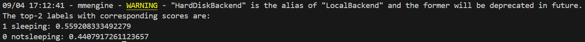

# Sleeping Student Detector (Classroom AI Project)
This repository contains a student sleep detection project powered by MMAction2, designed for classroom monitoring and research applications.

The project focuses on:

**Video Sleep Classification:** The model processes classroom video streams (such as lecture recordings or live webcam feeds) and classifies them as sleeping or not sleeping. The decision is based on the class with the highest probability score. When a sleeping event is detected, the system records the timestamp for further analysis.

